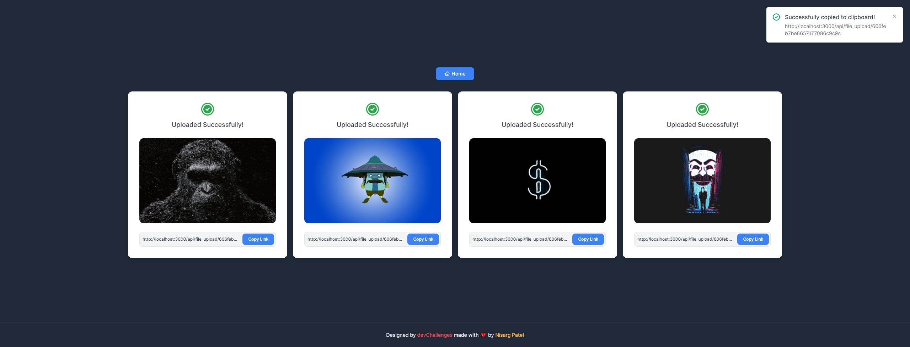

<!-- Please update value in the {}  -->

<h1 align="center">Image Uploader</h1>

<div align="center">
   Solution for a challenge from  <a href="http://devchallenges.io" target="_blank">Devchallenges.io</a>.
</div>

<div align="center">
  <h3>
    <a href="https://np-image-uploader.netlify.app/">
      Demo
    </a>
     |
     <a href="https://github.com/nisargp08/image-uploader-server">
        Server
     </a>
  </h3>
</div>


<!-- OVERVIEW -->

## Screenshots




### Built With

<!-- This section should list any major frameworks that you built your project using. Here are a few examples.-->
- [Vue.js](https://vuejs.org/)
- [Tailwind](https://tailwindcss.com/)


## How To Use

<!-- Example: -->

To clone and run this application, you'll need [Git](https://git-scm.com) and [Node.js](https://nodejs.org/en/download/) (which comes with [npm](http://npmjs.com)) installed on your computer. From your command line:

```bash
# Clone this repository
$ git clone https://github.com/nisargp08/image-uploader

# Install dependencies
$ npm install

# Run the app
$ npm run serve
```

## Contact

- Website [https://nisarg-patel.netlify.app/](https://nisarg-patel.netlify.app/)
- GitHub [@nisargp08](https://github.com/nisargp08)
